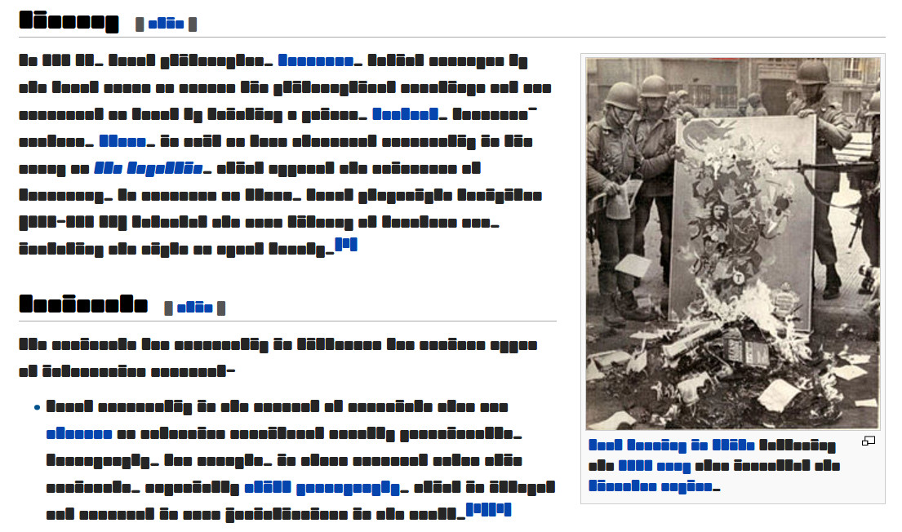

“Censorship ends in logical completeness when nobody is allowed to read any books except the books that nobody can read.” ― George Bernard Shaw

(การเซ็นเซอร์มีจุดจบที่สมบูรณ์ทางตรรกะ เมื่อไม่มีใครได้รับอนุญาตให้อ่านอะไร นอกจากหนังสือที่ไม่มีใครอ่านออก)

# ฟอนต์เวร

**เวร** เป็นฟอนต์ในอุดมคติสำหรับระบอบอำนาจนิยมซึ่งไม่อนุญาตให้ประชาชนแสดงความรู้สึกนึกคิดได้อย่างเสรี โดยเฉพาะในประเทศไทยที่รัฐบาลทหารต้องการให้พลเมืองสงบปากสงบคำ ฟอนต์ตัวนี้น่าจะเหมาะกับรัฐบาลเผด็จการเพื่อใช้หลอกตาโดยปกปิดสิ่งที่ตัวเองไม่อยากอ่าน ก่อนที่พวกเขาจะโตเป็นผู้ใหญ่และรู้จักเรียนรู้ที่จะอยู่กับการวิพากษ์วิจารณ์

สำหรับประชาชนทั่วไป ฟอนต์นี้เวรแน่แท้ในหลายภาษา และเป็น [Open Font License](http://scripts.sil.org/OFL) สนุกให้เต็มที่เลย!

# Vain Font

**Vain** is an ideal font for authoritarian regime where freedom of expression is not permitted, especially in Thailand where junta government wants to keep its citizen silent. So this font could do well for the dictators to visually disguise themselves by redacting every word they don't want to read before they grow up and learn how to live with criticism.

And for ordinary people, this font is really vain for many languages and it is [Open Font License](http://scripts.sil.org/OFL). Have fun!

